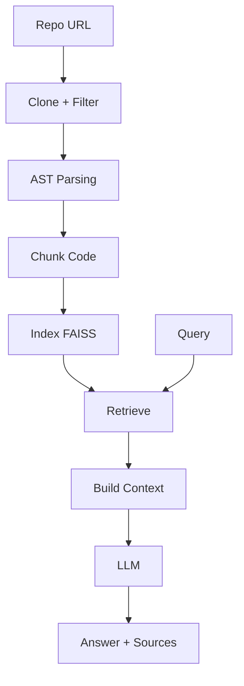

# CodeLens

CodeLens is a backend system that turns Git repositories into a queryable knowledge base using AST parsing and vector search.

[](https://fastapi.tiangolo.com/)
[](https://www.python.org/)
[](https://www.docker.com/)
[](https://www.sbert.net/)
[](https://github.com/facebookresearch/faiss)
[](https://groq.com/)

Focus: retrieving and explaining relevant code paths instead of analyzing the entire codebase

---

## System Design
- **Ingestion Pipeline**: Clones repositories and filters relevant source files to reduce noise (docs/tests excluded).

- **AST-Based Chunking**: Uses Python AST to extract functions and classes as complete logical units instead of raw text chunks.

- **Retrieval Pipeline**:
  - Vector search using MiniLM embeddings  
  - Keyword-based scoring for exact matches  
  - CrossEncoder reranking for final selection  

- **Per-Repo Indexing**: Maintains separate FAISS indexes per repository to avoid cross-repo mixing.

## Features

- Repository cloning + smart file filtering (only `.py` files)
- AST-based chunking that extracts functions, classes, and nested methods while preserving structure
- Per-repository FAISS indexes with embeddings
- Hybrid retrieval (vector search + keyword boost + CrossEncoder reranking)
- FastAPI backend with background ingestion support
- Strict grounding prompt with Groq for answer generation
- Dockerized deployment

---

## Tech Stack

- **Framework**: FastAPI
- **Code Parsing**: Python `ast` module
- **Embeddings**: sentence-transformers (all-MiniLM-L6-v2)
- **Vector Store**: FAISS (per-repo indexes)
- **LLM**: Groq (llama-3.3-70b-versatile)
- **Deployment**: Docker + docker-compose

---
```text
Code-Lens/
│
├── app/
│   ├── api/              # API routes
│   ├── core/             # Config and settings
│   ├── services/         # Ingestion, parsing, search logic
│   └── main.py           # FastAPI entry point
│
├── data/                 # Generated indexes (ignored)
├── repos/                # Cloned repositories (ignored)
│
├── .venv/                # Virtual environment (ignored)
├── .env                  # Environment variables (ignored)
├── .gitignore
├── .dockerignore
│
├── Dockerfile
├── requirements.txt
├── streamlit_app.py      # UI (optional)
```
---

---
## Key Decisions & Learnings

- **AST Chunking**: Replaced naive line splitting with AST parsing to keep full functions and classes intact. This was the biggest quality improvement.
- **Per-repo FAISS**: Simple, fast, zero-cost, and gives complete isolation between repositories.
- **Hybrid + Reranking**: Pure vector search was noisy. Adding keyword boost and CrossEncoder reranker noticeably improved relevant chunk selection.
- **Strict Prompting**: Learned how much the LLM tends to hallucinate or reconstruct when context is incomplete.

**Biggest Challenge**: Retrieval often returns definition-heavy chunks instead of actual execution flow. Making the system truly "understand" code connections proved harder than expected.

---

## Limitations
- Currently supports only Python
- Answers can still contain some guessing when retrieved chunks are incomplete
- Ingestion can be slow for large repositories
- No multi-turn conversation memory yet
- Retrieval quality depends heavily on chunking heuristics

---

## How to Run

### Using Docker (Recommended)

```
docker-compose up --build
```
The API will be available at http://localhost:8000

### Local Development
```
pip install -r requirements.txt
uvicorn app.main:app --reload
```
---
## Usage

### Ingest
POST /ingest
```
{
  "repo_url": "https://github.com/encode/starlette"
}
```

### Search
  GET /search?query=<your_query>&repo=<repo_name>
  
---
## Future Improvements
- [ ] Tree-sitter Integration: Expanding AST support to Go, TypeScript, and Java
- [ ] Simple call-graph for better dependency tracing
- [ ] Improve ranking quality
- [ ] Improve UI
